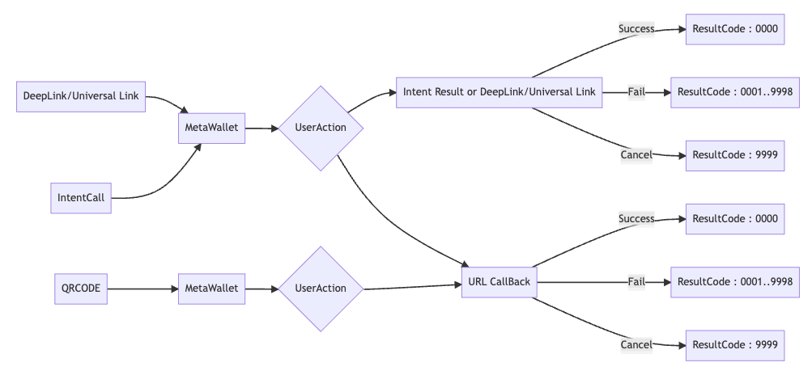

# 개요

### 지원가능 운영체제

* Google Chrome, Microsoft Edge, Naver Whale 중 하나가 구동 가능한 Windows 혹은 macOS
* iOS
* Android 8.0 이상

### 통신 방식

* Windows, macOS
  * QRCode 를 통한 호출
  * URL Callback을 통한 결과 전달
* iOS :&#x20;
  * Apple Universal Link/QRCode 를 통한 호출&#x20;
  * Apple Universal Link/URL Callback 을 통한 결과 전달
* Android
  * DeepLink/QRCode 를 통한 호출 시 DeepLink/URL Callback 을 통한 결과 전달
  * Intent 를 통한 호출 시 Intent Result/DeepLink/URL Callback 를 통한 결과 전달

### Diagram

#### Deeplink, QrCode 이용 단건 처리

<figure><figcaption></figcaption></figure>
